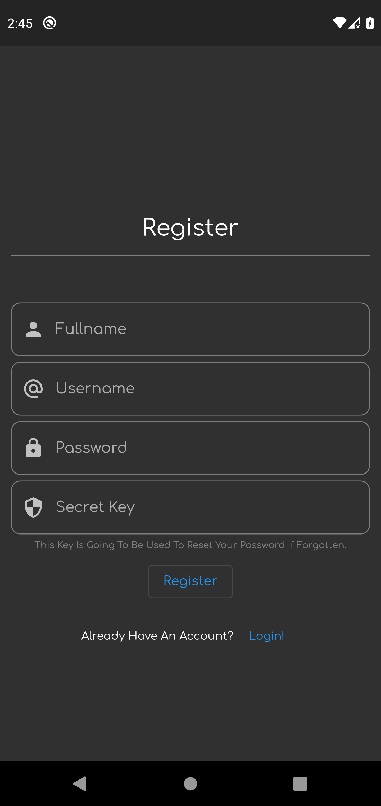
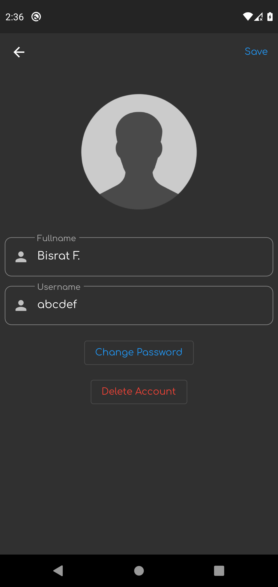
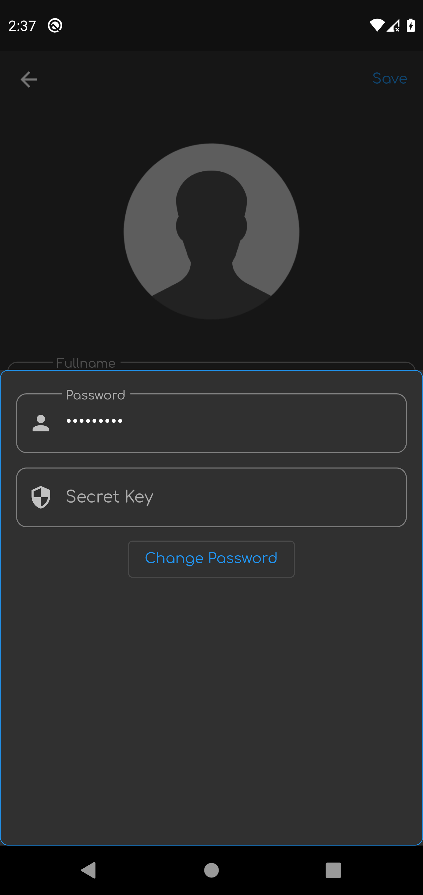
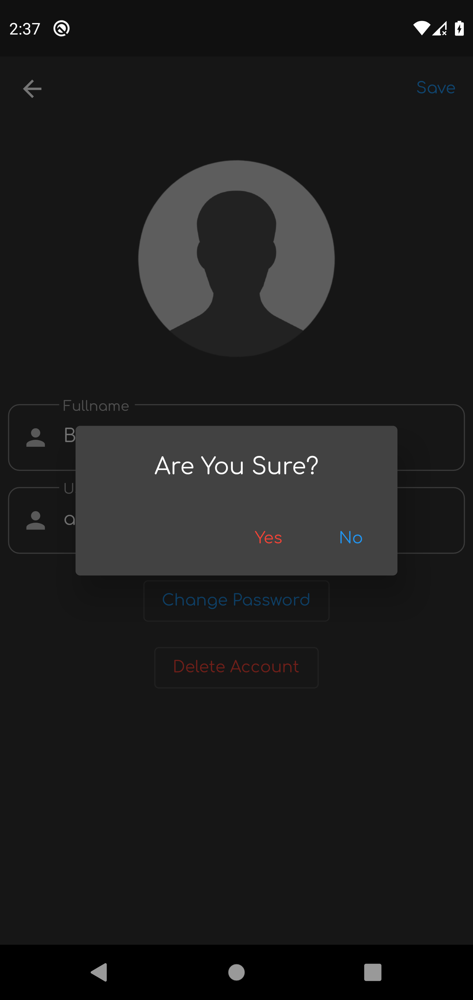
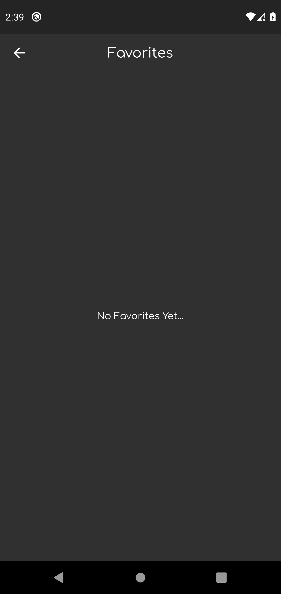

# Wall-e

Application Built By : Bisrat Fekede    ATR/0929/11

# Getting Started

The application name is Wall-e. 

It has 3 business features.

1. User CRUD
2. Downloading Images To Gallery
3. Saving Images As Favorite

This application is built upon flutter for the front-end (UI) by using [flutter_bloc](https://pub.dev/packages/flutter_bloc) for state management and [NodeJS](https://nodejs.org/en/) for the back-end (API).

This repo contains files for both the API and the flutter application.

To use the app, you must first run the node environment on your local machine and the code for the flutter application is so that it would run on the android emulator on the local machine.

To modify this you can go the data_provider files in each feature and modify the client address for the API request to the node application host.

## Instructions On How To Use The Application

First you have to make sure you have installed the [NodeJS](https://nodejs.org/en/) environment on your local machine to handle the API.

After installing [NodeJS](https://nodejs.org/en/), navigate to the root folder and open Command Prompt or any terminal and type in the command

```
npm i
```

to install the dependencies and modules need to run the application.

After that type in the following command to start handing API calls from the front-end of the application.

```
npm start
```

## UIs For The Application

## Login Page


## Register Page


## Password Resetting Page


## Homepage


## Profile Page




## Zoomed Image


## Favorite Images Added


## Favorites Page



A few resources to get you started if this is your first Flutter project:

- [Lab: Write your first Flutter app](https://flutter.dev/docs/get-started/codelab)
- [Cookbook: Useful Flutter samples](https://flutter.dev/docs/cookbook)

For help getting started with Flutter, view our
[online documentation](https://flutter.dev/docs), which offers tutorials,
samples, guidance on mobile development, and a full API reference.
